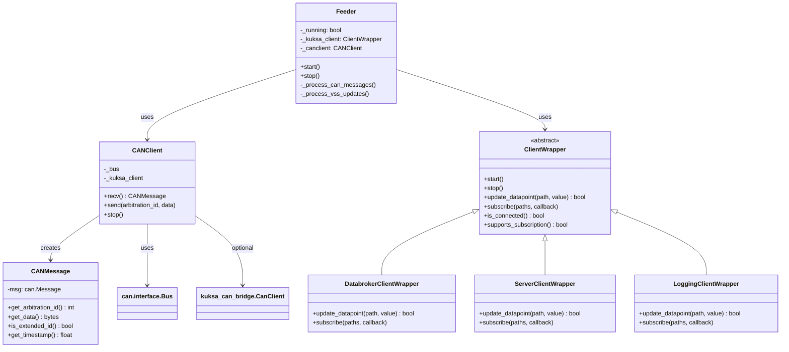

# Feeder Class Diagram & Run Instructions

## Class Diagram



------------------------------------------------------------------------

## Run the application

``` bash
docker run -it --rm \
  --name hr_zonal \
  --network kuksa-net \
  -e LOG_LEVEL=DEBUG \
  -v "${PWD}\net_conf.ini:/dist/config/dbc_feeder.ini" \
  -v "${PWD}\vss_dbc.json:/config/vss_dbc.json" \
  -v "${PWD}\vss_dbc.json:/dist/vss_dbc.json" \
  -v "${PWD}\dbc_default_values.json:/dist/dbc_default_values.json" \
  -v "${PWD}\handsomeno1.dbc:/dist/HnR.dbc" \
  ghcr.io/pmt563/virtual_can_windown/hr-zonal:sha-f0ad370@sha256:0f025c53ca36dab4e49e0f6e8b5777f57e7b80f4d6ed4a3b45dc07c6dd445544 \
  --server-type kuksa_databroker \
  --dbc2val \
  --val2dbc \
  --lax-dbc-parsing
```